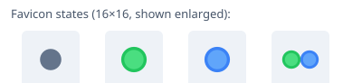

# dsh-tab-status-dot

A tiny browser-side plugin for the **DeepSeek Harness Web GUI** (`dsh web`) that shows a **status dot as the browser-tab favicon**, telling you at a glance whether any conversation has finished while you were away, or is waiting for you to make a choice.

No page-title text is modified — the indicator lives entirely in the tab icon (favicon), where size and colour are fully controllable.

> **New to this?** Read the beginner-friendly **[Getting started](GETTING-STARTED.md)** ([中文版](GETTING-STARTED.zh-CN.md)) — step-by-step for Windows, Linux and macOS, no coding required.



## States

| Favicon | Meaning | Returns to neutral when |
|---|---|---|
| Neutral dot | Default / a task is currently running | — |
| Light-green dot | ≥1 session finished running while you were **not looking** (tab in background, or viewing another session) | You **open** that session; if it was already the open session, staying on the page ≈1 s counts as read. Every unfinished "viewed" item must be handled before the dot returns to neutral |
| Light-blue dot | A session is **waiting for your choice** (question / approval / plan review) — not answered yet | Only after you **actually answer/choose** and the run resumes; merely viewing does not clear it |
| Two light dots (green + blue) | Both conditions above exist at the same time | Green clears by viewing; blue clears by answering |

### Rules

- A session finishing while you are **looking at the page and at that session** does **not** light up (you saw the result).
- A session finishing while the tab is **hidden/backgrounded lights up green even if it is the currently open session** — you were not actually watching it.
- Running again, or deleting the session, removes its stale reminder.
- Unviewed completions persist in `localStorage`, so a page reload does not lose them.

## Why it exists

The runtime's built-in model treats "session selected" as "viewed" — so a task finishing in the *open* session while the tab was hidden never produced a reminder. This plugin redefines "you were not looking" as *session not selected **or** page hidden*, which matches how people actually use the app (start a task → switch away → come back).

## How it works

- Registered as a **dual-face cordis plugin** (`dsh.client`, `platform: web`): the host half (`lib/index.js`) is an empty `apply`, the browser half (`exports["./client"]` → `lib/client.js`) is a classic-script module-loader bundle.
- Subscribes to the shared client-runtime `sessions` service (`ctx.get("sessions").list`), an observable snapshot carrying per-session `running`, `pendingInteraction`, `completed` and the open-session `current` id.
- Completeness signals: the runtime's own `completed` flag **plus** our own `running→idle` edge detection **plus** a "page was hidden since last visible observation" flag — so reminders are armed even when the browser throttles background timers and the transition is only observed after you return.
- Background resilience: browsers suspend `requestAnimationFrame` (and some event delivery) for hidden tabs, so the plugin also
  - polls the cheap cached snapshot every second,
  - paints through a short-timeout fallback as well as rAF,
  - refreshes immediately on `visibilitychange` / window focus.
- Rendering is coalesced & change-checked: at most one DOM write per frame, raw-string favicon comparison (never the normalized `.href` read-back), no writes when nothing changed.
- Takes over the favicon (`<link rel=icon>`) so browsers do not pick a competing brand icon; the original icon is restored on unload.

## Requirements

- DeepSeek Harness with a `web` profile (see the runtime's profile/plugin conventions), any modern browser.

## Installation

### How plugin deployment works in DeepSeek Harness

Every DSH surface is a *profile* directory (`$DSH_HOME/profiles/<name>`, e.g. `~/.dsh/profiles/web`). A plugin only has to satisfy two things:

1. **the package is resolvable from the profile** — i.e. it lives in `<profile>/node_modules/<package-name>` (pnpm installs there, but a plain copy works just as well);
2. **the profile registers a loader row for it** — one `insert` entry in `<profile>/cordis.patch.yml` naming the package.

After that the running instance hot-reloads user patches (~1 s) and serves the client bundle; you just refresh the page. The three methods below are therefore equivalent — they differ only in how the package reaches `node_modules`.

> **Verified installers.** CI exercises them on four real environments — `ubuntu-latest` (where `sh` is dash), `macos-latest` (BSD userland), Alpine/BusyBox `sh`, and `windows-latest` (Windows PowerShell 5.1). Each job installs into a profile shaped exactly like the shipped template (comment header + bare `[]`, no trailing newline), validates the resulting YAML with `js-yaml`, and checks the idempotent, append-to-existing-entries and uninstall paths.

### Method 1 — install script (recommended)

```powershell
# Windows (PowerShell)
git clone https://github.com/linksdeact-sys/dsh-tab-status-dot.git
cd dsh-tab-status-dot
powershell -ExecutionPolicy Bypass -File .\install.ps1
```

```sh
# macOS / Linux
git clone https://github.com/linksdeact-sys/dsh-tab-status-dot.git
cd dsh-tab-status-dot
./install.sh
```

The script copies the package into the `web` profile, appends the registration block to `cordis.patch.yml` (idempotent, keeps a `.bak` backup), and prints the next steps.
Options: `-Profile <name>` / `--profile <name>`, `-DshHome <path>` / `--dsh-home <path>`, `--uninstall`.

### Method 2 — package manager (`dsh plugin`)

If pnpm is available, the official route installs straight from GitHub into the profile:

```sh
dsh plugin --profile web add github:linksdeact-sys/dsh-tab-status-dot
```

…then register the row by appending this to `~/.dsh/profiles/web/cordis.patch.yml`:

```yaml
# >>> dsh-tab-status-dot >>>
- insert:
    - id: tab-status-dot
      name: '@pxy/dsh-tab-status-dot'
# <<< dsh-tab-status-dot <<<
```

### Method 3 — manual copy

Download the release zip (or copy from a clone) so the profile ends up with:

```
<profile>/node_modules/@pxy/dsh-tab-status-dot/
├── package.json
└── lib/
    ├── index.js
    └── client.js
```

and add the same `insert` block shown in Method 2 to `<profile>/cordis.patch.yml`.

### Verify

1. Refresh the Harness page — hard refresh (`Ctrl+F5`) if the old bundle was cached.
2. The tab icon shows a neutral dot. Start a task and switch to another page: when it finishes while you are away the dot turns **light green**; a question/approval waiting for you turns it **light blue**.
3. Optional server-side check: `GET http://127.0.0.1:3080/plugins/@pxy/dsh-tab-status-dot/client.js` returns `200`.

### Uninstall

```powershell
powershell -ExecutionPolicy Bypass -File .\install.ps1 -Uninstall   # Windows
./install.sh --uninstall                                           # macOS / Linux
```

or delete `<profile>/node_modules/@pxy/dsh-tab-status-dot` and the `insert` block by hand.

### Troubleshooting

| Symptom | Fix |
|---|---|
| Nothing appears after refresh | Make sure `cordis.patch.yml` holds the `insert` row with the exact package name, then hard-refresh; if your instance does not hot-reload patches, restart `dsh web` once. |
| `GET /plugins/.../client.js` returns 404 | The row is not registered in the running instance (patch layer not applied), or the package is not in the profile's `node_modules`. |
| `dsh plugin … add` fails | pnpm is missing/unavailable — use Method 1 or 3; neither needs a package manager. |
| Page looks broken after installing | Remove the row from `cordis.patch.yml` (or run the uninstaller) and refresh: the plugin unloads completely, including its favicon override. |

See [`INSTALL.md`](INSTALL.md) for the original step-by-step notes and operational details.

## Development

```
├── package.json          # dsh.client declaration (platform=web, injects client-runtime)
├── lib/
│   ├── index.js          # host half: empty apply (pure client plugin convention)
│   └── client.js         # browser bundle: module-loader factory + state machine + renderer
└── test/
    └── core.test.mjs     # pure-logic + browser-sandbox smoke tests (node:vm, no CJS globals)
```

Run the tests:

```sh
node test/core.test.mjs
```

The test harness evaluates `client.js` inside a `node:vm` sandbox that provides only browser-ish globals (`window`, `document`, `localStorage`) — the same conditions the DSH module loader creates — so a missing CommonJS-style wrapper (`exports is not defined`) or any load-time crash is caught before it ever reaches a real page.

Edit `lib/client.js` → refresh the page to test (the bundle is served `no-cache`).

## Notes & limitations

- Browser tab **titles are plain text**: a coloured dot there can only be an emoji, whose size/colour are fixed. That is why state colours live in the favicon and the page title is left untouched.
- Reminders are per-browser (`localStorage`); two browser tabs of the same profile share storage with last-write-wins semantics.

## License

[MIT](LICENSE)
